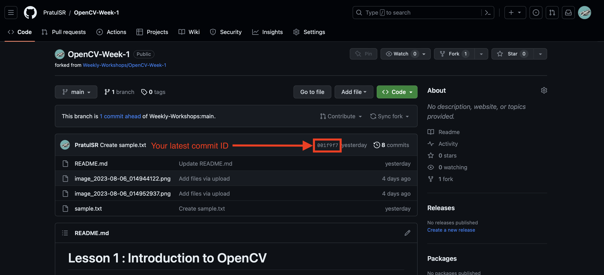
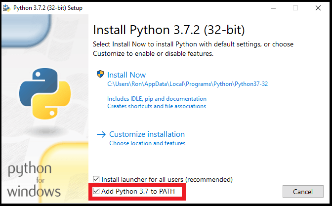
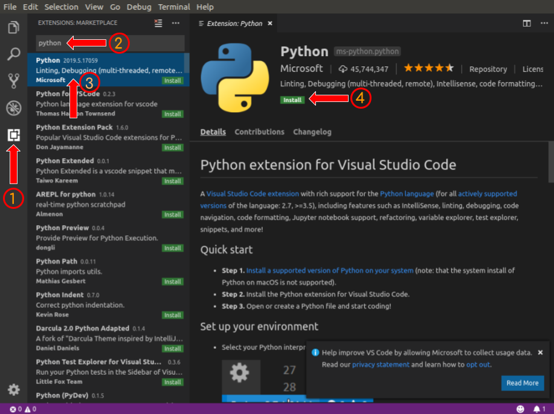

# Lesson 1 : **Introduction to OpenCV**

## Contents

1. How to show Proof of Work
2. Installing Python and an IDE
3. Installing OpenCV for python
4. Displaying Images and Videos
5. Scaling frames
6. Matplotlib and Colour Transformations

## Useful Links

- OpenCV Documentation: [https://docs.opencv.org/4.x/](https://docs.opencv.org/4.x/)
- OpenCV Python Tutorials: [https://docs.opencv.org/4.x/d6/d00/tutorial\_py\_root.html](https://docs.opencv.org/4.x/d6/d00/tutorial_py_root.html)
- Numpy References: [https://numpy.org/doc/1.23/reference/index.html#reference](https://numpy.org/doc/1.23/reference/index.html#reference)
- Git Tutorial : https://github.com/usydroboticsclub/intro

## How to show Proof of Work (and claim PEP Hours!)

When you finish these challenges and make your final commit, note down the commit ID and mention it in the attendance form.


This week's attendance form : https://forms.gle/6NtwvQVaP4eWAZ7V8

## Overview

OpenCV is an open-source library for image processing, computer vision and machine learning. It has been used extensively throughout the engineering industry for the past 20 years, with companies such as Google, Intel and Toyota using the library with applications ranging from self-driving vehicles to facial recognition.

The OpenCV library is available in a number of programming languages including Python, C++, Java and MATLAB making it highly accessibly to a wide number of programmers and engineers.

## Installing Python and an IDE

In order to complete the following series of workshops, it is necessary to download both Python and an IDE such as Visual Studio Code to work in.

1. **Python Download**

[https://www.python.org/downloads/](https://www.python.org/downloads/)

First of all download the latest available version of python from the link above.
When the installation is about to begin, be sure to click the checkbox saying "add to path"



2. **Visual Studio Code Download** 

[https://code.visualstudio.com/download](https://code.visualstudio.com/download)

Visual Studio is the next thing to download if you do not have an IDE (Integrated Development Environment). This software will allow you to write almost any coding language with a wide array of different extensions to make your life easier.

3. **Downloading python extension for Visual Studio Code**

Finally, downloading the python extension for VS code will allow you to code in Python. To do this, navigate to the marketplace and look for python.



## Installing OpenCV for Python

OpenCV can be installed using _pip_ like most libraries in the python ecosystem. To install OpenCV, first, make sure _pip_ is installed on your computer by running the following command in either command prompt (windows) or in the terminal (mac).

`pip --version`

It should result in a similar output to below: 

Now it's time to install OpenCV onto your computer using the following pip command.

`pip install opencv-python`

We will be using both Numpy and Matplotlib alongside OpenCV so make sure you have both libraries installed on your computer using the following commands:

`python -c "import numpy"`

`python -c "import matplotlib"`

If nothing happens, you have both libraries installed on your computer, otherwise, run the command which corresponds to the library you are missing:

`pip install numpy`

`pip install matplotlib`

To use OpenCV in a python project, `import cv2 as cv` at the top of your python file.

## **Displaying Images**

Displaying images and videos in OpenCV is a great way to see the effects of an operation on an image. To display an image, all you need is its file path and the following OpenCV functions:

### cv.imread(file\_path: str) -\> cv.Mat

- Reads an image from a specified file path which is passed to the function as a string.
- Returns a Mat object of pixels that represents the image. The Mat object can be passed into other functions to apply operations or display the image.

### cv.imshow(display\_name: str, image: cv.Mat) -\> None

- Displays an `image_`_ that is passed in as a Mat object (read in using _cv.imread()_).
- _`_display\_name_`_ is the name of the window that will appear after _cv.imshow()_ is called. It is passed in as a string.

### cv.waitKey(wait\_time: int) -\> int

- Pauses the program when a display window is present, usually due to _cv.imshow()_ being previously called.
- If the integer argument `wait_time` is zero, _cv.waitKey()_ will wait until the user presses a key on the keyboard. If a positive integer _n_ is passed instead, all display windows currently open are closed after _n_ milliseconds, i.e. _cv.waitKey(20)_ closes all windows after 20 milliseconds.
- Returns the ASCII code of the key pressed. This is useful for image control features such as pausing and restarting videos.

## Task 1: Displaying an image

Please refer to the function prototypes on the previous page if you are unsure how to use the functions referenced in this section, otherwise, feel free to search them up in their documentation on the OpenCV website (link on the first page).

1. Create a new Python file and `import cv2 as cv` to use the functions provided in the OpenCV library.

2. Take a photo of yourself and save it to the same directory as the python file you just created. If you are unable or don't want to take a photo of yourself, download an image off the internet instead.

3. Use _cv.imread()_ to read the image from its file path and assign it to an image variable. Then pass the image variable into _cv.imshow()_, also specifying its display window name.

4. Use _cv.waitKey()_ to make sure the image stays open. Pass a value of zero for the wait\_time argument so that the image will only close when you press a key on the keyboard

Example Code
```python
import cv2 as cv

def main():

  beach = cv.imread("../Images/Beach.jpg")

  cv.imshow("Beach", beach) _# Show window_

  cv.waitKey(0) _# Wait and close window only when key is pressed_

if __name__ == "__main__":

  main()
```
# Displaying Videos

A video is essentially just a sequence of images (frames) shown at a rapid rate. The rate at which these frames are shown is measured using frames per second (FPS). As a consequence, displaying a video is not too different from displaying an image.

The only difference is using _cv.VideoCapture()_ and _capture\_obj.read()_ instead of _cv.imread()_ to read a video from a file path as well as using loops to iterate through the many frames contained inside a video.

### cv.VideoCapture(file\_path: str) -\> capture\_obj

- Reads a video into a capture object from a specified file path. If an integer is passed in instead of a string file\_path, _cv.VideoCapture()_ can read from a camera connected to your computer such as your webcam. If you only have two cameras, pass zero (0) to access the first camera and one (1) to access the second camera.
- Your capture object is the name of whatever variable you assigned _cv.VideoCapture()_ when called. If you are still confused, please refer to the example code for video below.

### capture\_obj.read() -\> tuple[bool, cv.Mat]

- Reads a single frame from the capture object.
- It returns a tuple containing a _retval_ and the frame as a Mat object. _retval_ is a boolean value (True or False) that signals whether a frame was successfully read or not. _retval_ is important for when you run out of frames at the end of a video.
- The read-in frame can be shown using _cv.imshow()_ just like with images.

Usually, a capture object is created at the start of the program and read sequentially within a while True loop. The _retval_ is constantly checked to make sure the frame was correctly read before anything else is done. In our case, we are assuming the video has ended when _retval_ is False.

In the general structure for video reading on the next page, note that 17 is passed as the argument for _cv.waitKey()_ to automatically close the display window after 17 ms. 17 ms roughly corresponds to 60 FPS. If you are using a connected camera with a live feed, the value passed to _cv.waitKey()_ makes no difference as long as it's greater than one.

Also, note the if statement which controls when the video is ended. Here, 'd' is used as an escape key. The _ord()_ function simply returns the ASCII code for 'd'. You can use any key to video as long as it is specified.

## Task 2: Displaying a Video

1. Create a new Python file and `_import cv2 as cv`._

2. Create a capture object using _cv.VideoCapture()_. If you have a camera attached to your device, pass in zero as the only argument, otherwise download an mp4 from YouTube and pass the mp4's file path as a string argument instead.

_If you're lazy, post this link_ [_https://www.youtube.com/watch?v=fjUO7xaUHJQ_](https://www.youtube.com/watch?v=fjUO7xaUHJQ) _into this website_ [_https://en.y2mate.is/6/youtube-to-mp4.html_](https://en.y2mate.is/6/youtube-to-mp4.html) _and save it into your local folder._

1. Using the video reading scaffold provide on the previous page as a reference, read and display your video.

2. If you are using a downloaded mp4 video, try changing the integer passed to _cv.waitKey()_ and see observe what happens.
```python
import cv2 as cv

capture = cv.VideoCapture("video path")

while True:

  retval, frame = capture.read() _# retval is bool for successful read_

  # Exit loop once end of the video is reached_

  if not retval:

    break

  cv.imshow("Display name", frame)

  if cv.waitKey(17) ==ord('d'): _# Close if 'd' is pressed_

    break

capture.release()

cv.destroyAllWindows()
```
# Scaling Image and Video Size

Sometimes image and video frames are too small or too big to easily view when displayed using _cv.imshow()_. Fortunately, OpenCV provides a function that allows us to easily scale up or down frames called _cv.resize()_. A more user-friendly wrapper function is also provided below.

### cv.resize(image: cv.Mat, new\_dimension, interpolation=) -\> cv.Mat

- Returns a new image with the specified dimensions. `new_dimensions` is a tuple which is passed (width, height).
- When changing the size of an image, the number of pixels in an image changes. This means we need to approximate the value of the new pixels using an interpolation method. When decreasing the size of an image, the _interpolation=cv.INTER\_AREA_ is generally best. When increasing the size of an image, _interpolation=cv.INTER\_CUBIC_ is best.

A cool video by Computerphile explaining how image interpolation works: [https://www.youtube.com/watch?v=AqscP7rc8\_M](https://www.youtube.com/watch?v=AqscP7rc8_M)

Don't worry if you don't understand the above function, the function below will cover most of your resizing needs while maintaining the image aspect ratio.
```python
def rescale(frame: cv.Mat, scale:float) -\> cv.Mat:

  height =int(frame.shape[0] \* scale)

  width =int(frame.shape[1] \* scale)

  dim = (width, height)

  return cv.resize(frame, dim, interpolation=cv.INTER\_AREA)
```
_rescale_ takes the image/frame being resized as well as the scaling factor of the dimension change as a float, i.e. 0.7 scales the image to 70% of its original size.

## Task 3: Resizing an image

1. Using the provided rescale function, change the size of the image or video from tasks 1 and 2.

2. **Extension -** Try implementing your own version of rescale, utilising _cv.resize()_.

# Matplotlib and Colour Space Transformations

The following section assumes basic familiarity with matplotlib.pyplot functions such as _plt.plot()_ and _plt.subplot()_. Each reference of plt assumes import _matplotlib.pyplot as plt_.

Often it can be useful to display an image using Matplotlib in order to inspect pixel values or organise images into neat subplots for a report. As Matplotlib is generally quite slow to display images when compared to _cv.imshow()_, it is not recommended to show a video directly using the Matplotlib library. If Matplotlib must be used with a video, a control key using _cv.waitKey()_ should be used.

To display a Mat object (image) using Matplotlib, the function _plt.imshow()_ can be used. To edit the plot, familiar functions used for regular plots such as _plt.title()_, _plt.show()_ and _plt.xlabel()_ can be used.

### plt.imshow(image: cv.Mat) -\> None

- Creates a plt image that can be edited using matplotlib functions.
- To show the image, call _plt.show()_.

It should be noted that OpenCV stores image pixels as Blue, Green, Red (BGR) instead of the standard Red, Green, Blue (RGB). Matplotlib assumes images to be in the form RGB, meaning we must convert from BGR to RGB if we want the image to appear in matplotlib as we expect.

OpenCV provides the functions _cv.cvtColor()_ to convert between any colour space supported by OpenCV. Commonly used colour spaces include the previously mentioned BGR and RGB as well as HSV and Grayscale.

### cv.cvtColour(image: cv.Mat, flag: int) -\> cv.Mat

- Converts an image from one colour space to another, returning the converted image.
- The `flag` argument specifies which colour space conversion is to take place. These flags can be found under ColorCodeConversions in the OpenCV docs: [https://docs.opencv.org/4.x/d8/d01/group\_\_imgproc\_\_color\_\_conversions.html#ga4e0972be5de079fed4e3a10e24ef5ef0](https://docs.opencv.org/4.x/d8/d01/group __imgproc__ color__conversions.html#ga4e0972be5de079fed4e3a10e24ef5ef0)

## Task 4

1. Create a new Python file, importing both _cv2_ and _matplotlib.pyplot_.

2. Read in the image from Task 1 and convert it from a BGR colour space to an RGB colour space using the flag cv.COLOR\_BGR2RGB.

3. Using _plt.imshow()_, create a plot with the image containing an appropriate title and other useful annotations.

4. **Extension -** Try showing the image on matplotlib without applying the colour space transformation and see what it looks like.

5. **Extension -** Try converting from BGR to a different colour space than RGB, such as HSV or Grayscale and display it using matplotlib.

As a side note, if you hover your mouse over the matplotlib plot you displayed, you can see some values in the bottom right corner. `x` and `y` are the (x,y) coordinates of the pixel under your mouse tip, while the values below are the value of the pixel itself. These pixel values come in handy particularly when thresholding images which we will see in a later lesson.

## Extension:

Create a user interface for displaying videos using _cv.waitKey()_ and the keyboard. Some extra additions to the interface my include adding a pause button, a reset button or a button which displays the frame on matplotlib.
